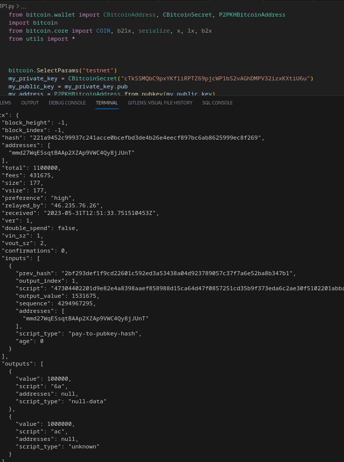

# In the Name of God

Mohammad Mohajel Sadegi - 810199483

# Phase 1:

In this phase, we are generating bitcoin testnet address.
First we create a random 256 bit private key and after that we do following:

    Use secp256k1 elliptic curve to generate public key from private key
    Hash the public key using SHA-256
    Hash the result again using RIPEMD-160
    Add version byte (0x00 for mainnet, 0x6f for testnet) to the RIPEMD-160 hash
    Compute checksum by hashing the version + RIPEMD-160 hash twice and taking the first 4 bytes
    Concatenate the version + RIPEMD-160 hash + checksum
    Encode the result using Base58Check encoding

After that we generate this random private keys repeatedly to find our desired vanity address

    A vanity address in Bitcoin is a custom Bitcoin address that contains specific chosen characters, such as a person's name or a specific phrase. While all Bitcoin addresses are technically random strings of numbers and letters, a vanity address is generated in such a way as to include a desired string of characters.

    Generating a vanity address can be a time-consuming process, as it requires repeatedly generating new addresses until one is found that meets the desired criteria. There are various tools available that can help facilitate the generation of vanity addresses, such as Vanitygen and VanitySearch.

    It is worth noting that while vanity addresses can be fun and personalized, they do not offer any additional security or privacy benefits over randomly generated addresses. In fact, using a vanity address could potentially make it easier for a malicious actor to determine the private key associated with that address, since the custom string of characters could provide additional clues about the key. Therefore, it is important to exercise caution and use best practices when generating and using Bitcoin addresses, regardless of whether they are vanity addresses or not.

You can find results below:


And to make sure our address is correct:


# Phase 2:

We create some keys and address in keys.py to use in this phase:


```python
bitcoin.SelectParams("testnet")

key1 = CBitcoinSecret("cTkSSMQbC9pxYKf1iRPTZ69pjcWP1bS2vAGhDMPV32izxKXtiU6u")
key1_addr = P2PKHBitcoinAddress.from_pubkey(key1.pub)

key2 = CBitcoinSecret("cNuJHQPJ417DT55KgNbvVNzKXXLX4UFxoRb1gb9sRx1Ga9oxaVuK")
key2_addr = P2PKHBitcoinAddress.from_pubkey(key2.pub)

key3 = CBitcoinSecret("cVTTtWtqqiqouZfaNiDck2eYoT8FDyg82TsFBKhWEgnq8pa7LjHG")
key3_addr = P2PKHBitcoinAddress.from_pubkey(key3.pub)

key4 = CBitcoinSecret("cVcbvpStwtvL91yQWAzReREQHJe2gNb5x2VCDSnkmnngvMM5eKWK")
key4_addr = P2PKHBitcoinAddress.from_pubkey(key4.pub)

key5 = CBitcoinSecret("cT4RSXGDp7Fa7aMfFr7zaocNbGy7gW53MLwGsygV6dWfzHfwLHM1")
key5_addr = P2PKHBitcoinAddress.from_pubkey(key5.pub)

print(key1_addr)
print(key2_addr)
print(key3_addr)
print(key4_addr)
print(key5_addr)

# mmd27WqESsqtBAAp2XZAp9VWC4Qy8jJUnT
# mxpf6p8WE7tUmYoPZSwJ9HbTYARZo6SQFw
# mr5euUubdz2MBaP6CQJSjoFdyzfYju2ov8
# mshR5fsbimUp8hJ9JReRs5vLNVXnY1FJKn
# mn6na19twmjVicKvnkHpYypn8mJs6F5e1b

```

Then we get some bitcoin in testnet for our transactions which you can see
 [here](https://live.blockcypher.com/btc-testnet/address/mmmm5XQyEpcVBPQdwYSWpX2aUi33f7YFRv/)

* it didnt worked! because of unknwn resons I could not use not-compressed version of addresses

I got bitcoin to key1 which you can see below


## Part 1:

We need to create a transaction with two outputs:

### first one every one can spend

we only need to put *OP_CHECKSIG* in script so it returns true for every unlocking script

```python
def P2PKH_free_scriptPubKey():
    return [OP_CHECKSIG]
```

### second one no one can spend

we only need to put *OP_RETURN* in script so nobody can use it. 

```python
def P2PKH_return_scriptPubKey():
    return [OP_RETURN]
```

results can be shown below:




After creating transaction, we move spendable money to our key2 address:


## Part 2:

we create a *2 from 3 Multisig* and move from key2 address to their:

This is our multisig locking script which we lock with key3 key4 key5 public key
```python
def multisig_locking_script(public_key_1, public_key_2, public_key_3):
    return [OP_2, public_key_1, public_key_2, public_key_3, OP_3, OP_CHECKMULTISIG]
```


Then we move all money to key3 address from this multisig address providing only key3 and key4 signature


## Part 3:

we provide two prime numbers: 91 and 23.

And we use following locking and unlocking scripts

```python
def customized_locking_script(sum_nums: bytes, sub_nums: bytes):
    return [
        OP_2DUP,
        OP_ADD,
        OP_HASH160,
        Hash160(sum_nums),
        OP_EQUALVERIFY,
        OP_SUB,
        OP_HASH160,
        Hash160(sub_nums),
        OP_EQUAL,
    ]


def customized_unlocking_script(prime_num1: bytes, prime_num2: bytes):
    return [prime_num1, prime_num2]
```
We duplicate both numbers then add them and hash them and compare it with Hash160(sum_nums)
then we sub those two nums and compare them again.

So we need to provide both nums to use bitcoin in this address


After that we provide those numbers and move money to key5 address


## Links

[key1_address](https://live.blockcypher.com/btc-testnet/address/mmd27WqESsqtBAAp2XZAp9VWC4Qy8jJUnT/)

[key2_address](https://live.blockcypher.com/btc-testnet/address/mxpf6p8WE7tUmYoPZSwJ9HbTYARZo6SQFw/)

[key3_address](https://live.blockcypher.com/btc-testnet/address/mr5euUubdz2MBaP6CQJSjoFdyzfYju2ov8/)

[key4_address](https://live.blockcypher.com/btc-testnet/address/mshR5fsbimUp8hJ9JReRs5vLNVXnY1FJKn/)

[key5_address](https://live.blockcypher.com/btc-testnet/address/mn6na19twmjVicKvnkHpYypn8mJs6F5e1b/)


# Phase 3:

We want to generate new block after block 9483.

    HASH(BLOCK(9483)) = 00000000cb0356066b1f8d2482c4747e8da716bf355b71f88fad0b3c3bdd62d8 HEX


After taht, we create coinbase transaction which is our only transaction and our merkel root is this transactions HASH

Transaction_input = 32 bytes 0
Transaction_input_index = 0xFFFFFFFF
Reward = 3.125 BTC
Coinbase_Data = 810199483MohammadMohajelSadegi

You can see result below:


